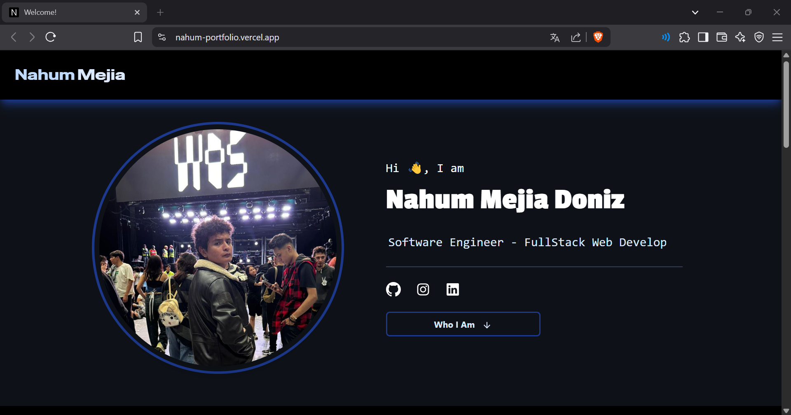
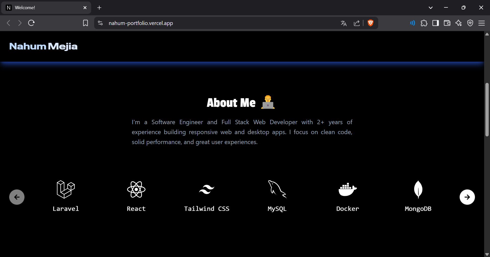
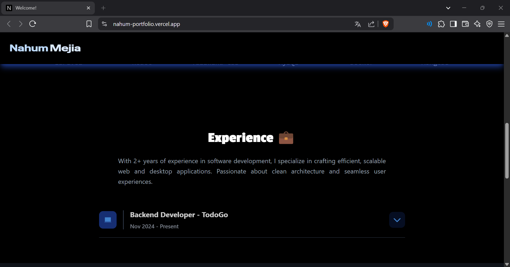
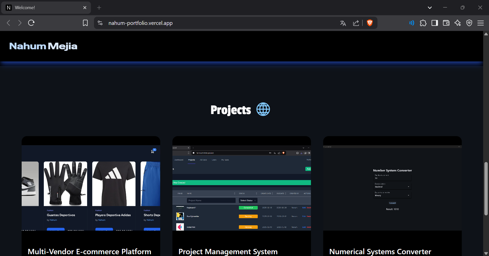
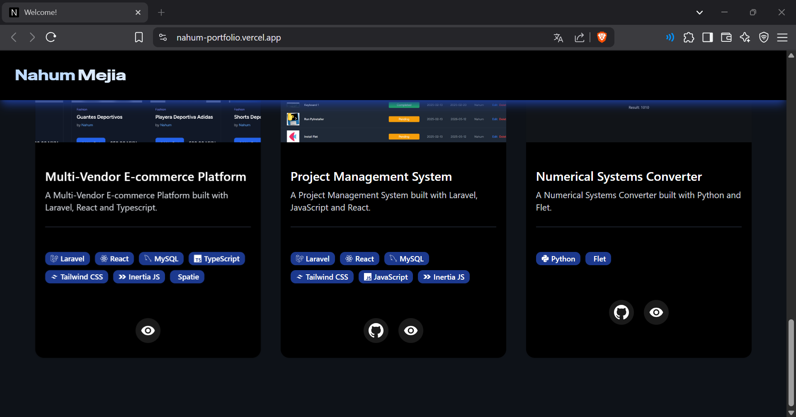

# Portfolio Template
A modern and clean portfolio template where you can showcase who you are, your experience, and your projects — built with React, Vite, TypeScript, and styled using shadcn/ui components.

## Built With:


## Features
- **Presentation**: A modern and visually appealing introduction, complete with a profile picture of your choice.
- **Social Media Links**:
  - Showcase your social profiles with clean icons. Defaults include:
    - Instagram
    - Linkedin
    - Github
- **About Me Section**:
  - Highlights your background, skills, and a brief personal introduction.
- **Tech Stack**:
  - Highlight your own tech stack by name and icon, with a cool hover glow effect.
- **Experience**:
  - A detailed timeline showing your professional roles, responsibilities, and the services you've contributed to.
- **Projects**:
  - Highlight your personal or professional projects with:
    - Project name
    - Tech stack used
    - Live preview link
    - GitHub repository (You can choose if the repository is visible or not).
- **Responsive Design**: Fully functional across devices (desktop, tablet, and mobile).
- **And More Coming oon...**

## Prerequisites
Before setting up the project, ensure you have the following installed on your system:
- **Node.js** (v18 or higher)
- **NPM**

## Installation
1. Clone the repository
2. Install Node.js dependencies: ```npm install``` (Use your preferred package manager)
3. Run the development server: ```npm run dev```
4. The application will be available at http://localhost:5173

## Usage
After installing all dependencies and running the development server you can start customizing your portfolio:

- Update Your Information
  - Edit the data arrays such as your experiences, projects, and social links directly in the corresponding component files (e.g., Experience.tsx, Projects.tsx, SocialMedia.tsx).

- Change Profile Picture and Bio
  - Replace the default image and modify your personal description in the Home.tsx section.

- Customize the Tech Stack
  - Add or remove technologies with their names and icons in the AboutMe.tsx file. Iconify is used for consistent and scalable icons.

- Adjust Colors and Styles
  - Tweak the design using Tailwind CSS classes, or enhance the UI with more shadcn/ui components.

- Deploy Your Portfolio
  - Once you're happy with the design, deploy it to platforms like Vercel, Netlify, or GitHub Pages.

## Screenshots






# Demo
See my own portfolio deployed on Vercel:
- https://nahum-portfolio.vercel.app/
